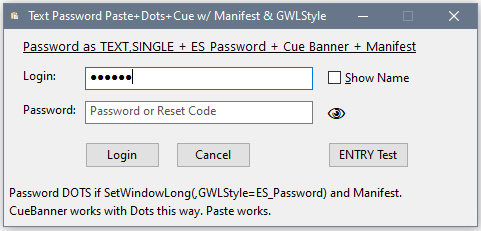

## Clarion Password Entry Cannot Paste - Release 2

The Release 1 method of using `SendMessage(, EM_SETPASSWORDCHAR)` was not ideal if the program has a Manifest for Visual Styles. The Clarion Password ENTRY with a Manifest gets Dots instead of Asterisks so looks much better. The best way to change a TEXT control for Password is with `SetWindowLong(,GwlStyle,+ES_Password)` which with a Manifest shows Dots, plus Cue Banners work. If you do not have a Manifest see "Release 1" below.

In Release 2 build the PasswordStyle4Text.CwProj project and the below window will allow you to test a TEXT Password that has Dots, Paste, Cue banners and a Manifest. One call to the new function `PasswordOnText_SetGwlStyle PROCEDURE(LONG TextSingleFEQ, BYTE TurnOffPassword=0)` in CBPassword.CLW makes this work by changing the control GWL Style using `SetWindowLong()`.


<p>

Code changes are similar to Release 1, just a different function to call:

- [ ] Add `PasswordOnText_SetGwlStyle() PROCEDURE` to your APP with `INCLUDE('CBPasswordText.inc'),ONCE` in the MAP
- [ ] Change `ENTRY,PASSWORD` to `TEXT,SINGLE`
- [ ] Call `PasswordOnText_SetGwlStyle(?Pwd)` to make it an ES_Password &ast;&ast;&ast;&ast;&ast; style Edit Control
- [ ] Change any code with `?{PROP:Password}=1/0` to `PasswordOnText_SetGwlStyle(?,0/1)`
- [ ] *Optional:* In ?Pwd EVENT:Accepted call `PasswordAcceptedClipClean(?)` to clear the clipboard if the password was pasted

4/9/2021 - Added a "Peek Eye" Icon (Webdings N) next to the Password field. When user hovers the mouse over the "Peek Eye" the password unhides.

4/09/2021 - Added an "Eye Checkbox" "latched button" next to the "Peek Eye" as alternative. Some were concerned hover alone could accidentally reveal password.

4/10/2021 - For original "Peek Eye" added optional "HoverMustClick EQUATE(1)" to allow requiring user to click on Eye. Password hides when mouse moves away or typing starts (i.e. hover ends). 
 
**Tip:** The ES_Password style must be set when the control is created, so adding the style to an existing control will not work. To get the RTL to Destroy and Create the control a property must be changed that the RTL recognizes as needing the Destroy+Create. The easiest is alignment with ``?Text{PROP:Right}=1 ; ?Text{PROP:Left}=1``. The RTL preserves the other style bits, like ES_Password. Thanks to Jim Kane for that tip, which he acknowledged Richard Chapman as the source. The desired style then was ES_NoHideSel that on TEXT shows the selection when the control loses focus, something nice for spell check.  Back in C6 setting PROP:Left=1 alone worked, but apparently an optimization checks if the alignment did not change.

---

## Clarion Password Entry Cannot Paste - Release 1

Someone at SoftVelocity decided pasting into an ENTRY,PASSWORD was a security risk so changed Paste to simply not work?! This confuses users. It makes it hard for the user to use complex passwords, which are more secure. C++, VB, C#, Delphi do not have this restriction.

One workaround is to `Alert(CtrlV)` and when the key is pressed `CHANGE(?Pwd,ClipBoard())` so paste works. You also need to `Alert(MouseRight)` then `Popup('Paste')` and handle that. A bonus is you can clear the password from the Clipboard as a good security thing.

The project in this repository shows an easier workaround and some other tricks and tips, plus a better looking password control.


## TEXT Control with Win32 ES_PASSWORD can Paste

The easy way to fix Paste is to use the Windows API. The Clarion TEXT control is the Win32 Edit Control so responds to API calls. Instead of a Clarion ENTRY use a TEXT, it must have the SINGLE line attribute. Send it one message and it becomes a Password Edit control, plus Paste works!
```clarion
!---- Change TEXT,SINGLE to PASSWORD so Paste works ----
PasswordOnTextPROP PROCEDURE(LONG TextFEQ, BYTE TurnOff)
EM_SETPASSWORDCHAR EQUATE(00CCh)
    CODE
    SendMessage(TextFEQ{PROP:Handle}, EM_SETPASSWORDCHAR, CHOOSE(~TurnOff,VAL('*'),0) , 0)  !Send Zero for Off
    HIDE(TextFEQ) ; UNHIDE(TextFEQ)  !Repaint
    RETURN
```

- [ ] Add `PasswordOnTextPROP() PROCEDURE` to your APP with `INCLUDE('CBPasswordText.inc'),ONCE` in the MAP
- [ ] Change `ENTRY,PASSWORD` to `TEXT,SINGLE`
- [ ] Call `PasswordOnTextPROP(?Pwd)` to make it a password &ast;&ast;&ast;&ast;&ast; style Edit Control
- [ ] Change any code with `?{PROP:Password}=1/0` to `PasswordOnTextPROP(?,0/1)`

## Password Control Asterisks [&ast;&ast;&ast;&ast;&ast;] are Ugly

The default password control shows all typed characters as Asterisks &ast;&ast;&ast;&ast; which is an ugly and small superscript character. The API allows any character. Change the Font to Wingdings and you can have a big dots  &#9679;&#9679;&#9679;&#9679; or a big asterisks (above capture left/right). The included project shows several characters.

```clarion
PasswordOnTextDots PROCEDURE(LONG FEQ, BYTE TurnOff=0)
PwdChar LONG
EM_SETPASSWORDCHAR EQUATE(00CCh)
    CODE
    PwdChar=CHOOSE(~TurnOff,6Ch,0) !Wingdings 6C is fat dot
    FEQ{PROP:FontName}=CHOOSE(~TurnOff,'Wingdings',0{PROP:FontName})
    SendMessage(FEQ{PROP:Handle}, EM_SETPASSWORDCHAR, PwdChar, 0)
    IF FEQ{PROP:Type}=CREATE:Entry THEN
       FEQ{PROP:Password}=TurnOff  !Must use Prop: for ENTRY
    END
    HIDE(TextFEQ) ; UNHIDE(TextFEQ)  !Repaint
    RETURN  
```

## Clarion Entry change Password Character

The Clarion ENTRY responds to the EM_SETPASSWORDCHAR message and changes the password character. The API message will NOT correctly turn on/off the password feature, so you must still use the PROP:Password property for something like "Show user name" (as show in the code in the section above). In the example see `PasswordEntryAsDots()`. Paste still will not work, so why bother with this? Change to TEXT.

## Simplest Workaround - a Paste Button

The simplest workaround to the crippled Entry Password Paste is to add a Paste button next to the ENTRY control. The user may still be confused but at least he can paste. (See the screen shot password right side.)

## Remove Password from Clipboard

One feature of alerting keys and handling paste is the cliboard can be cleared of the password. This can still be done by putting code like below in EVENT:Accepted for the password to check if it matches the clipboard. This delays the clearing until after the user tabs out of the control, but that should not be long. The INC file includes function `PasswordAcceptedClipClean()` to handle this simply.
```clarion
      CASE ACCEPTED()
      OF ?TextPwd  !Clear Password on Clipboard after Paste
                   IF TextPwd=CLIPBOARD() THEN
                      SETCLIPBOARD('')
                   END
```

## TEXT Control can have Cue Banner

If you change the password to a TEXT,SINGLE you can use a Cue Banner as shown below.


The cue uses the font of the control so the password cannot use Wingding Dots. To set a Cue Banner just requires sending one wide string message as shown below:

```clarion
SetCueBanner PROCEDURE(LONG FeqTextSL, STRING CueText, BOOL OnFocusShow=0)
BStrCue  BSTRING
Cue_WStr LONG,OVER(BStrCue) !BSTRING is Pointer to WSTR
  CODE
  BStrCue=CLIP(CueText)   !BSTRING converts to UniCode.
  SendMessageW(FeqTextSL{PROP:Handle},1501h, OnFocusShow, Cue_WStr)      
  RETURN    !TB_SETCUEBANNER = EQUATE(1501h)
```

## Wingdings Character Hunter

Click the Hunt button, pick a font and every possible character shows in an Entry to see if it would make a good password character.


<p>

A poem with a special character ...
   > Little Mary took her skates,  
   > upon the ice to frisk.  
   > Wasn't she a little fool,  
   > her little *
